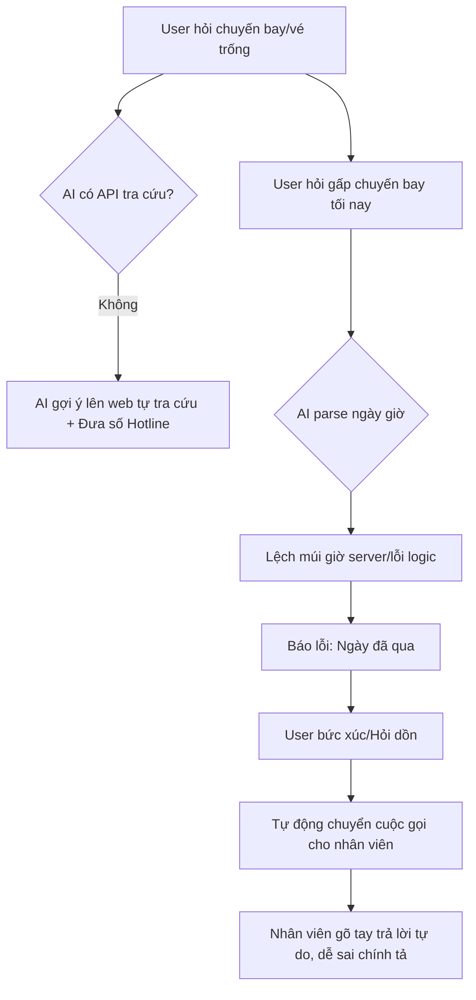
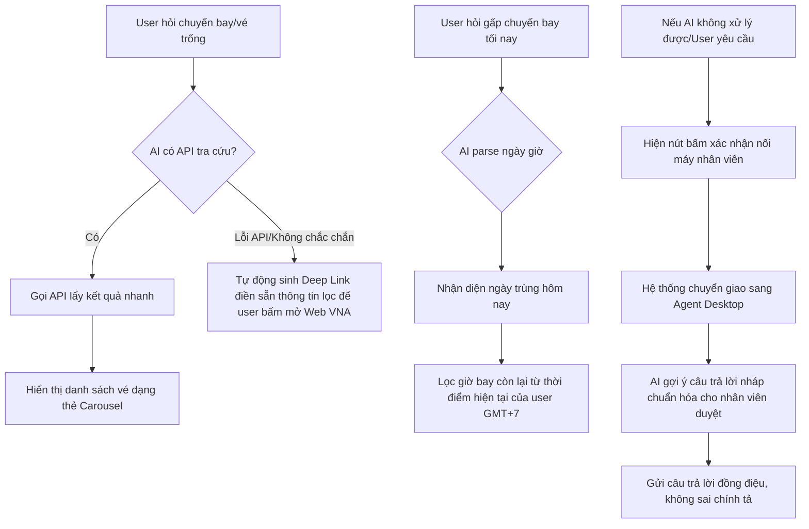

# Workshop — Mổ App AI Thật: Vietnam Airlines Trợ Lý Ảo NEO

**Thời gian:** 35-45 phút  
**Hình thức:** cá nhân  
**Học viên:** Nguyễn Nhứt Đăng  
**Mã học viên:** 2A2026006062  
**Sản phẩm lựa chọn:** Vietnam Airlines — Trợ lý ảo NEO (Website/Zalo VNA)

---

## 1. Chọn một sản phẩm để dùng thử

| Sản phẩm | AI feature | Cách truy cập |
|---|---|---|
| Vietnam Airlines — NEO | Chatbot hỗ trợ vé, hành lý, khiếu nại | Trải nghiệm trực tiếp trên Website của Vietnam Airlines |

---

## 2. Dùng thử: promise vs reality

### Lời hứa của hãng (Promise)
*   Hỗ trợ mua vé trực tuyến, tra cứu thông tin hành trình, số lượng vé, giá vé.
*   Cung cấp thông tin chính sách hành lý, hoàn/đổi vé, thủ tục hàng không.
*   Hỗ trợ khách hàng 24/7 một cách nhanh chóng và tự động.

### Thực tế trải nghiệm (Reality)
*   **Với các thông tin chính sách tĩnh (RAG/Knowledge Base):** Trả lời rất tốt, đầy đủ cấu trúc và chi tiết (ví dụ: Quy định đóng gói nước mắm Phú Quốc quấn băng keo, đựng thùng xốp; Phí sửa đổi tên đệm gõ sai áp dụng mức 50.000 VND từ 01/06/2025).
*   **Với các thông tin cần dữ liệu thời gian thực (Real-time/Data-tool):** 
    *   Khi hỏi số lượng vé còn lại trong khung giờ cụ thể ("từ hà nội đến tphcm từ 12pm đến 00h còn bao nhiêu vé"), bot không tra cứu trực tiếp mà đẩy số hotline và hướng dẫn user tự truy cập web/app để kiểm tra.
    *   **Lỗi đồng bộ thời gian hệ thống:** Khi hỏi chuyến bay tối nay (03/06/2026), bot trích xuất đúng ngày `03/06/2026` nhưng lại báo lỗi logic *"Ngày khởi hành bạn chọn đã qua"* (có thể do lệch múi giờ UTC/GMT+7 hoặc so sánh thời gian bị lỗi).
*   **Cơ chế Hồi phục (UX Recovery - Human Handover):** Khi user dồn ép hoặc bot không thể giải quyết sau nhiều câu hỏi liên tiếp, hệ thống tự động chuyển tiếp cuộc trò chuyện sang tư vấn viên thật (Human-in-the-loop).

### Bằng chứng thu thập (Evidence)
*   **Prompt/Input thử nghiệm:** *"từ hà nội đến tphcm từ 12pm đến 00h còn bao nhiêu vé"*
    *   *Phản hồi của NEO:* *"Để kiểm tra chính xác số lượng vé còn trống... Quý khách vui lòng truy cập website hoặc ứng dụng... Số điện thoại: 1900 1100..."*
*   **Prompt/Input thử nghiệm:** *"Có chuyến bay nào từ Hà Nội đi Sài Gòn tối nay sau 8h tối mà giá dưới 1 triệu rưỡi không?"*
    *   *Phản hồi của NEO:* Báo lỗi logic *"Ngày khởi hành bạn chọn đã qua"* cho ngày hiện tại (03/06/2026).
*   **Prompt/Input thử nghiệm:** *"vậy thì đâu có ngăn cản bạn trả lời câu hỏi của tôi, hãy làm đi"* (sau khi bot giải thích phạm vi hỗ trợ).
    *   *Phản hồi của NEO:* *"Xin quý khách vui lòng chờ một lát, nhân viên hỗ trợ khách hàng sẽ hỗ trợ quý khách..."* -> Sau đó xuất hiện tư vấn viên thật nhảy vào chat: *"Good day! How may we assist you? / Dạ bạn cung cấp mã dặt chỗ nhe s"*.

---

## 3. Vẽ 4 paths

| Path | Mô tả thực tế từ trải nghiệm |
|---|---|
| **Happy** | Khi hỏi quy định nước mắm Phú Quốc hoặc phí đổi tên đệm. AI trả lời chính xác, dẫn luật chi tiết, trình bày rõ ràng từng gạch đầu dòng. |
| **Low-confidence** | Khi hỏi số lượng vé trống trong khung giờ cụ thể, AI không chắc chắn nên tự động đẩy hotline `1900 1100` và khuyên người dùng tự tra cứu trên website để tự bảo vệ thông tin. |
| **Failure** | Khi hỏi chuyến bay tối nay, bot parse ngày hiện tại nhưng báo lỗi logic "ngày đã qua" và từ chối xử lý tiếp. |
| **Correction** | Thay vì để user tự sửa ngày hoặc đưa ra Date Picker, hệ thống tự động nhận diện việc hỏi nhiều không giải quyết được và thực hiện chuyển giao cuộc gọi sang nhân viên hỗ trợ là con người (Human Rescuer). Tuy nhiên, nhân viên thật gõ chữ bị lỗi chính tả ("dặt chỗ nhe s") làm giảm tính đồng điệu thương hiệu. |

---

## 4. Viết finding thành quyết định

### Finding 1: Thiếu tích hợp dữ liệu thời gian thực (Data-tool layer)
*   **Trigger:** Khi user hỏi số lượng vé trống trong khung giờ nhất định.
*   **Failure:** AI không có API kết nối để truy vấn trực tiếp kho vé (Inventory).
*   **Impact:** Người dùng phải chuyển kênh (Context switching) ra ngoài để tự tìm kiếm, gây đứt gãy luồng trải nghiệm mua hàng.
*   **Lỗi thuộc layer:** `data-tool` (Thiếu tích hợp API tìm chuyến bay thực tế).
*   **Nên sửa bằng:** Tạo liên kết sâu (Deep Link) tự động điền sẵn tham số tìm kiếm, hoặc tích hợp API tra cứu nhanh để hiển thị số chỗ trống trực tiếp trong khung chat.

### Finding 2: Lỗi logic so sánh thời gian (Intent/Data layer)
*   **Trigger:** Khi user hỏi chuyến bay trong ngày hiện tại sử dụng các từ khóa tương đối ("tối nay", "hôm nay").
*   **Failure:** Bot nhận diện đúng ngày đi nhưng so sánh sai múi giờ (hoặc so sánh giờ hiện tại trên server) dẫn đến báo lỗi "ngày khởi hành đã qua".
*   **Impact:** Chặn đứng nhu cầu đặt vé gấp của khách hàng dù yêu cầu hoàn toàn hợp lệ.
*   **Lỗi thuộc layer:** `intent / data` (Lỗi so sánh ngày giờ và lệch múi giờ).
*   **Nên sửa bằng:** Đồng bộ hóa múi giờ máy chủ về GMT+7. Cập nhật logic: nếu ngày trùng ngày hiện tại, cho phép tìm kiếm các giờ bay còn lại của ngày hôm đó thay vì chặn hoàn toàn.

### Finding 3: Quy trình chuyển giao người thật chưa đồng bộ (UX Recovery / Human-in-the-loop)
*   **Trigger:** Khi cuộc hội thoại đi vào bế tắc hoặc user yêu cầu trực tiếp.
*   **Failure:** Hệ thống chuyển sang người thật nhưng phong cách trò chuyện bị thay đổi đột ngột (từ ngôn ngữ trang trọng của bot sang ngôn ngữ tự do có lỗi chính tả của nhân viên hỗ trợ: *"Dạ bạn cung cấp mã dặt chỗ nhe s"*).
*   **Impact:** Giảm tính chuyên nghiệp của thương hiệu quốc gia và làm khách hàng cảm thấy thiếu nhất quán.
*   **Lỗi thuộc layer:** `UX recovery` + `human role`.
*   **Nên sửa bằng:** Tích hợp công cụ hỗ trợ tư vấn viên (Copilot): AI gợi ý sẵn câu trả lời nháp chuẩn hóa để tư vấn viên duyệt trước khi gửi đi, đảm bảo tính chính xác và không sai lỗi chính tả.

---

## 5. Sketch as-is / to-be

### Luồng hiện tại (As-is Flow)

### Luồng đề xuất (To-be Flow)

---

## 6. Tự kiểm trước khi nộp

- [x] Có ít nhất 1 screenshot hoặc observation cụ thể. (Đã sử dụng chi tiết đoạn log chat thực tế của người dùng với các case nước mắm, sửa tên đệm và lỗi ngày tháng).
- [x] Có đủ 4 paths hoặc nói rõ path nào chưa có trong product. (Đã phân tích đủ Happy, Low-confidence, Failure, Correction).
- [x] Finding được viết thành product decision, không chỉ là nhận xét. (Đã có 3 findings cấu trúc chi tiết theo layer và cách khắc phục).
- [x] Sketch có as-is và to-be. (Đã có sơ đồ Mermaid chi tiết cho As-is và To-be).
- [x] Có một câu nói rõ finding này sẽ đổi gì trong SPEC. (Xem chi tiết bên dưới).

> [!IMPORTANT]
> **Thay đổi quan trọng đối với SPEC dự án nhóm từ phát hiện này:**
> Từ việc phân tích chatbot NEO, chúng tôi quyết định thay đổi SPEC của sản phẩm nhóm:
> 1. Thiết kế cơ chế **Deep Link Fallback** để khi AI không đủ tự tin tra cứu vé, nó sẽ tự tạo đường link lọc sẵn thay vì bắt khách hàng tự tìm.
> 2. Đưa vào quy chuẩn **AI-Copilot hỗ trợ tổng đài viên** nhằm chuẩn hóa phản hồi khi chuyển giao sang người thật, đảm bảo không xảy ra lỗi chính tả và đồng điệu tone giọng thương hiệu.
